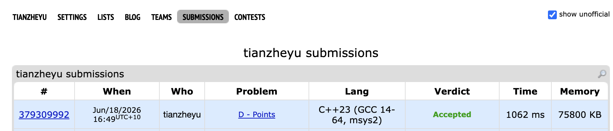

# Problem Set 3

## E. Points

### Process
The question is saying that we have a Cartesian coordinate system where (0,0) is located in the bottom-left corner. We have 3 operations:

1. add: we add point (x, y) into our coordinate system
2. remove: remove point (x, y) from out coordinate system
3. find: we return the point strictly above and strictly to the right of point, we will pick the leftmost one, if it is not unique, we will chooses the bottommost one.

### Challenges and Overcoming
When coding my segment tree, I ran into a bug where my search function wasn't correctly pruning the search space for points strictly to the right of the query. I found the issue when I traced my base cases and realized my boundary condition, tree[root].range.second <= x, was misaligned with the 1-based index I generated during coordinate compression. Next time, to prevent this kind of off-by-one error with strict inequalities, I will explicitly write down the logical bounds (e.g. $X_{node} \leq X_{query}$ ) on paper before translating them into recursive return conditions.
