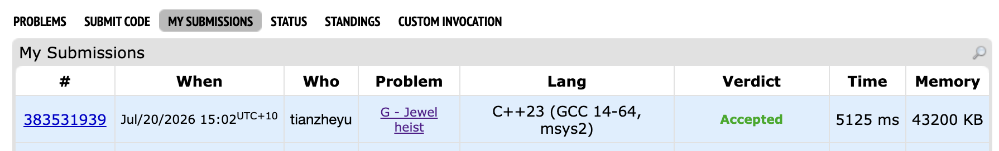

# Problem Set 3

## G. Jewel heis

### Process
Transformed the problem into finding maximal empty rectangles for each excluded color using a monotonic stack, then used a horizontal sweep line and a segment tree to count the jewels inside these candidate rectangles.

### Challenges and Overcoming
When coding my sweep line event sorting, I ran into a bug where my segment tree was undercounting the maximum number of jewels for certain candidate rectangles. I found it when I printed out the segment tree query results and noticed that jewels lying exactly on the top boundary of the rectangle were being excluded from the total count. 

The issue was a flaw in my sorting logic for events that share the exact same Y-coordinate. I was processing the rectangle evaluation queries before inserting the newly encountered jewels into the segment tree. Because the problem explicitly states a grab takes jewels "lying on some horizontal segment or below it" (inclusive boundary), the jewels at height $Y$ must be processed and added to the segment tree before the rectangle at height $Y$ is queried. 

Next time to prevent this bug, whenever I implement a sweep line algorithm, I will explicitly define and write down a tie-breaker rule for events at the same coordinate. I will map out whether the geometric boundaries are inclusive or exclusive beforehand to guarantee that data structures are updated in the correct order before being queried.