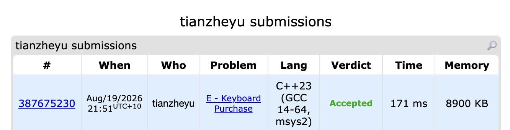

# Problem Set 4

https://codeforces.com/submissions/tianzheyu#

## E. Keyboard Purchase

### Process
The problem asks us to find a permutation of a keyboard of size $m$ (up to 20) that minimizes the total typing distance for a given string. Since $m \le 20$, this suggests a Bitmask DP approach where the state represents the set of characters already placed on the keyboard. The core idea is that each time we place a new character, the distance added to the total cost is exactly the number of adjacent character pairs in the password where one character is already placed and the other is not.

### Challenges and Overcoming
When implementing the state transitions, calculating the cost for each mask from scratch would take $O(m^2 \cdot 2^m)$, which is extremely risky for a 1-second time limit. 

To optimize this, I calculated the cost iteratively alongside the DP, but I ran into a logical bug regarding how the edge weights shift when a new character is added. I resolved this by using `__builtin_ctz(mask)` to isolate the newly added character `i` and basing the new cost on `prev_mask`. The tricky part was getting the inclusion-exclusion right: if a character `j` was already in `prev_mask`, adding `i` means they are no longer separated by the "boundary", so I had to subtract their frequency (`cost[mask] -= counter[i][j]`). If `j` was not yet placed, adding `i` creates a new boundary crossing, so I added the frequency. Next time I deal with delta-based cost transitions in Bitmask DP, I will draw a boundary diagram on paper first to clearly map out which edges are entering and leaving the cut-set before writing the code.