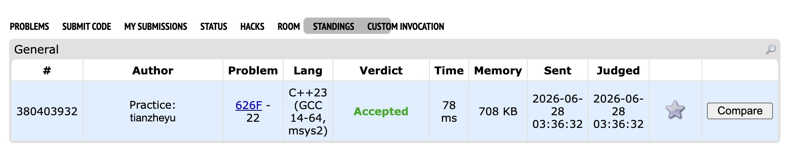

# Problem Set 4

https://codeforces.com/submissions/tianzheyu#

## F. Group Projects

### Process
This problem can be solved by first sorting the students' work times and then using dynamic programming. The state tracks the number of currently "open" groups (where the minimum is set but the maximum is not) and the accumulated total imbalance. The imbalance is incrementally updated at each step based on the difference between adjacent elements multiplied by the number of open groups.

### Challenges and Overcoming
When implementing the state transitions, I ran into a logical bug regarding the combinatorial multipliers. Specifically, for the transition where the number of open groups `q` remains the same, I initially multiplied the previous state by `q`, thinking the current student's only option was to join one of the `q` existing open groups. 

I found the bug when I traced the first sample test case and saw my output was lower than expected. I realized I had completely forgotten that a student can form a group entirely by themselves (acting as both the minimum and maximum, which effectively opens and closes a group in a single step). This adds exactly 1 extra valid choice, making the correct multiplier `q + 1`. Next time I write a DP counting solution, I will explicitly list out all disjoint sub-actions and verify their individual counts before combining them into a single mathematical expression.
