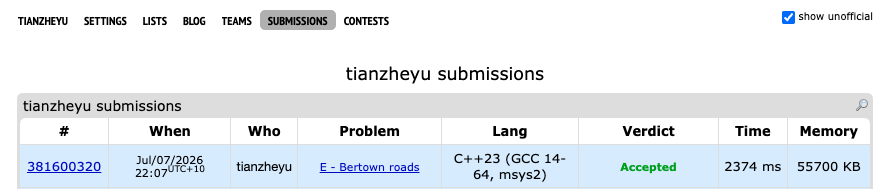

# Problem Set 5

## C. Bertown roads




https://codeforces.com/submissions/tianzheyu#


### Process
The problem asks us to assign directions to all undirected edges such that the resulting directed graph is strongly connected. By Robbins' theorem, this is possible if and only if the original graph is 2-edge-connected (i.e., contains no bridges). 

We can solve this using Tarjan's bridge-finding algorithm via DFS. We maintain `tin` (discovery time) and `low` (lowest reachable time) for each node. As we traverse, we naturally orient tree edges forward (from current node to next node). When we encounter a back-edge (a node already visited), we orient it upward (current node back to the ancestor). If at any point `low[next] > tin[curr]`, a bridge is found, and we output 0. Otherwise, the orientations we collected form a valid answer.

### Challenges and Overcoming
When I was first trying to direct the back-edges during the DFS, I ran into a bug that resulted in duplicate edges being printed, which caused my output to have more than $m$ edges. The issue was in this block of code:
```cpp
if (tin[next]) {
    low[curr] = min(low[curr], tin[next]);
    // Bug was here: I printed every back-edge from both ends
    directed_edges.push_back({curr, next}); 
}
```
Because the graph is initially undirected, a back-edge connects an ancestor and a descendant. Since both nodes explore their adjacency lists, they both eventually "see" each other as a visited node. Without a directional check, I was outputting both `{descendant, ancestor}` and `{ancestor, descendant}`. I found the bug when I realized my output had too many lines. I fixed it by adding the condition `if (tin[curr] > tin[next])` so that the back-edge is only recorded when we are looking from the descendant back up to the ancestor. Next time I process undirected graphs with back-edges, I will explicitly track the edge traversal direction using discovery times or a visited edge set to prevent bidirectional double-counting.
