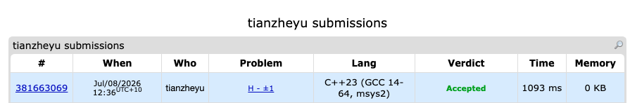

# Problem Set 5

## D. +-1

https://codeforces.com/submissions/tianzheyu#

### Process
The problem presents a 3 x N grid where we need to choose the signs of variables such that after sorting each column independently, the middle row consists entirely of 1s. Since sorting a column of three 1s and -1s places the median in the middle, the condition simplifies to: every column must contain at least two 1s. For a column with elements X, Y, Z, this is the same as saying ((X or Y) and (Y or Z) and (X or Z)). The entire problem can be modeled as a standard 2-SAT (2-Satisfiability) problem.

### Challenges and Overcoming

My initial challenge was a design flaw: I attempted a greedy strategy horizontally, which failed because the variables are highly interdependent globally.

After pivoting to a 2-SAT implication graph using Kosaraju's algorithm, I ran into a bug where my program failed to identify the correct SCCs. I found the bug when I printed the intermediate SCC groupings and noticed the logic was completely broken as I had forgotten to explicitly build the reversed graph (rev_adj) and accidentally reused the visited array (already full of true) from the first DFS pass without resetting it.

Next time to prevent these missing step and state leakage bugs during an exam, I will write out the strict phases of Kosaraju's algorithm (Build Both Graphs $\rightarrow$ DFS 1 $\rightarrow$ Reset Visited Array $\rightarrow$ DFS 2) as comments before coding any actual logic, ensuring no structural steps are skipped.
