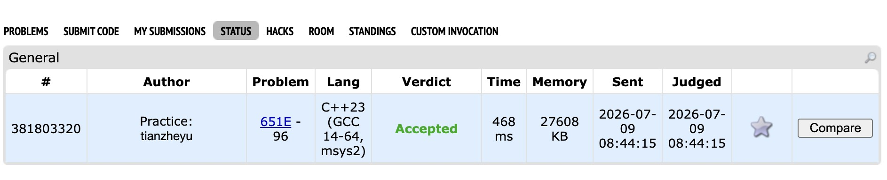

# Problem Set 5

## F. Table Compression

https://codeforces.com/submissions/tianzheyu#

### Process
To compress the table while maintaining the strict relative order of elements in both rows and columns, we must process the cells in ascending order of their original values. For each row and each column, we maintain the maximum compressed value assigned so far (max_r and max_c). The core algorithm involves finding all cells with the exact same value, grouping those that share a row or column using a DSU or graph traversal, and assigning all cells in the same connected component a new value equal to max(max_r, max_c) + 1.

### Challenges and Overcoming
When I first implemented the DSU to group equal values, I ran into a severe Time Limit Exceeded error. My initial draft was clearing or re-instantiating the DSU parent array and the `comp_max` array for every set of unique values. Since there can be up to $n 	imes m$ unique values, doing an $O(n+m)$ reset inside the loop pushed the worst case complexity to $O(n \cdot m \cdot (n+m))$, easily blowing past the 4 second time limit. 

I identified the bottleneck and optimized it by doing a manual rollback. Instead of clearing the whole array, I only reset the specific row and column indices (`dsu.reset(r)` and `dsu.reset(c + n)`) that were modified during the current step. This brought the reset time down to $O(K)$, where $K$ is the number of elements with that specific value. Next time I use data structures inside a grouped iterative process, I will ensure the cleanup phase's complexity is strictly proportional to the group size rather than the total number of vertices in the graph.