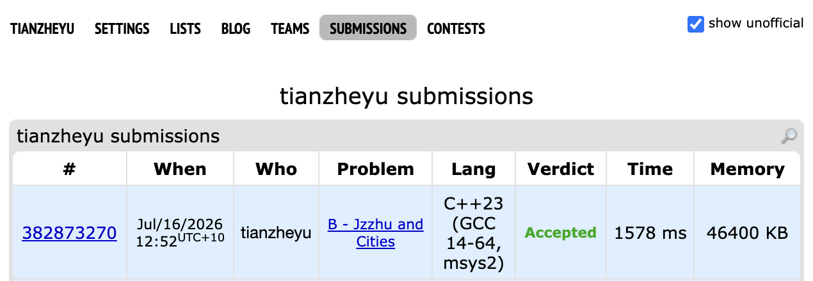

# Problem Set 6

## B. Jzzhu and Cities

https://codeforces.com/submissions/tianzheyu#

### Process
I used Dijkstra's algorithm with a priority queue to find the shortest paths and tracked the number of valid incoming shortest-path edges for each city.

### Challenges and Overcoming

1. When coding my priority queue processing loop, I ran into a performance bug that would lead to a TLE error. I found it when realizing that since C++ priority queues do not support a decrease-key operation, outdated and longer path states were staying in the queue and causing redundant calculations. Next time to prevent this bug, I will always include a  checking `if (current_dist > distances[current_node]) continue;` after popping a node from the queue.

2. When coding the final counting logic to close train routes, I ran into a logical bug where my program could accidentally close all routes to a city, disconnecting it entirely. I found it when considering an edge case where multiple train routes to the same city had the exact same shortest length; my code closed all of them because the `ways[city] > 1` condition remained true for every route evaluated. Next time to prevent this bug, I will ensure I update state tracking variables immediately upon taking action, such as decrementing `ways[city]--` after closing a route, so subsequent checks evaluate the properly updated state.