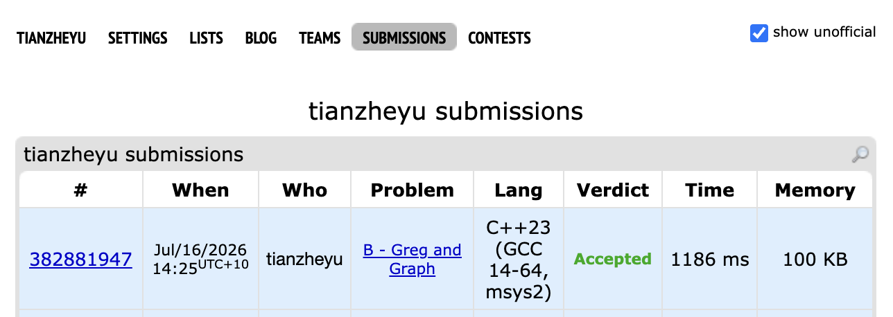

# Problem Set 6

## C. Greg and Graph

https://codeforces.com/submissions/tianzheyu#

### Process
I solved the problem by processing the node deletions in reverse order, adding nodes one by one and updating the shortest paths dynamically using Floyd-Warshall Algorithm.

### Challenges and Overcoming

When coding the initialization phase, I ran into a bug where my program outputted completely incorrect distances. I found it when I realized I had read the input graph into a 0-indexed `adj` matrix, but my shortest-path logic was running on a completely separate 1-indexed `dist` matrix that I had initialized entirely with infinity (`1e18`).

Next time to prevent this bug, I will ensure consistent indexing throughout the entire program (sticking to 1-based indexing for graph problems) and directly read the input weights into the primary data structure (`dist` matrix) being used for the calculations, rather than creating redundant and disconnected intermediate arrays.