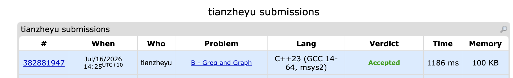

# Problem Set 6

## D. Complete The Graph

https://codeforces.com/submissions/tianzheyu#

### Process
I used Dijkstra's algorithm to find the lower and upper bounds of the shortest path by toggling the erased edges, and then greedily tested them to find a critical edge to adjust.

### Challenges and Overcoming

1. When coding my shortest path logic to test different edge weights, I ran into a severe bug where the graph's state became corrupted and inconsistent during traversal. I found it when I realized that decrementing a counter and modifying edge weights inside the Dijkstra neighbor-checking loop caused bidirectional edges to have different weights depending on which direction they were traversed. Next time to prevent this bug, I will strictly decouple the graph's structural representation from its state by using a separate, static weight array accessed via edge id.

2. When coding the math logic to adjust the critical edge's weight to exactly hit the target length L, I ran into a bug where my final shortest path was exactly 1 unit shorter than required. I found it when I reviewed my calculation and saw I used an assignment operator (`=`) instead of an accumulation operator (`+=`), which overwrote the base weight of 1 that the edge already had. Next time to prevent this bug, I will carefully distinguish between absolute values and deltas, to make sure I add the required difference to the current baseline state.