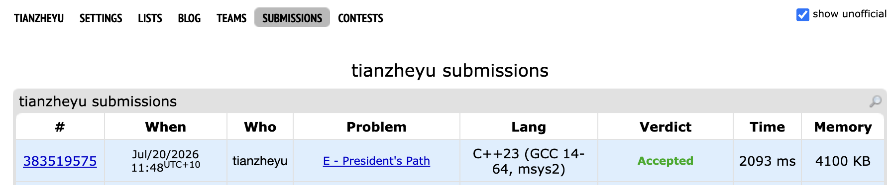

# Problem Set 6

## E. President's Path

https://codeforces.com/submissions/tianzheyu#

### Process
Implemented a Shortest Path DAG approach, running Dijkstra from each node and using bitset to track predecessor networks via topological state transitions.

### Challenges and Overcoming
Initially, I ran into a Time Limit Exceeded issue because my algorithm nested loops to check every edge against every $(s, t)$ vertex pair. I realized this was fundamentally flawed when I calculated the worst case operations: an $O(n^2 \cdot m)$ approach with $n=500$ and $m \approx 125,000$ leads to over 30 billion operations, which can not finish in 4 second limit. Next time to prevent this design flaw, I will explicitly calculate the worst case operation bound before coding and actively look for ways to reuse states instead of brute forcing combinations.

Transitioned from a brute force edge checking approach to a shortest path DAG approach, running Dijkstra from each node and using bitset to track predecessor networks via topological state transitions.

Later, when coding my DAG state transition loop, I ran into a bug where my program was outputting multiple extra lines of entirely zeros. I found it when I ran the sample test case and saw the console print out six lines of `0 0 0...` instead of a single formatted matrix. Tracing back the logic, I realized I had declared `vector<int> order(n);` for my topological sort but forgot to populate it with actual node IDs. I also accidentally nested the final output double loop inside the outermost `s` loop. Next time to prevent this bug, I will explicitly populate my vectors before passing them into custom sort comparators, and I will double check my bracket scoping to ensure final output logic is strictly separated from the main calculation loops.