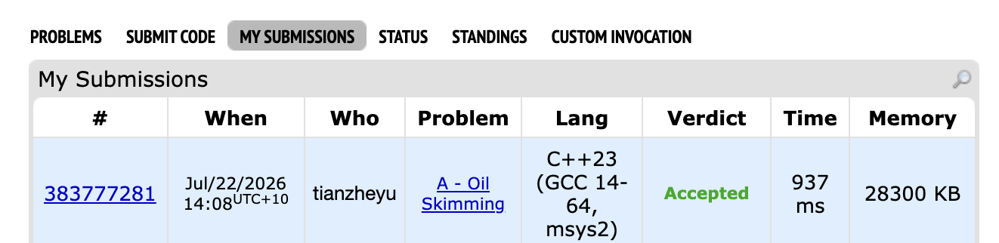

# Problem Set 7

## C. Oil Skimming

https://codeforces.com/submissions/tianzheyu#

### Process
Implemented a maximum flow network approach using Dinic's algorithm to solve a 1x2 domino tiling/bipartite matching problem on a grid via checkerboard coloring.

### Challenges and Overcoming

1. When coding my flow network topology, I ran into a bug where my program was missing valid scoop combinations and outputting a lower max flow than expected. I found it when I traced my grid loops and realized that by only checking the "down" and "right" directions from my black cells, I was missing valid bipartite pairs where a white cell was positioned above or to the left of a black cell. Next time to prevent this bug, I will explicitly draw out the physical flow of data on paper to ensure I check all four adjacent directions when connecting one bipartite set to another.

2. Later, when running my algorithm on the judge, I ran into a severe Memory Limit Exceeded error. I found it when I reviewed my FlowNetwork struct and realized I had initialized a 2D adjacency matrix for up to 90,000 nodes, which attempted to allocate over 60GB of memory for a very sparse grid graph. Next time to prevent this bug, I will calculate the absolute worst case memory of my data structures before coding and strictly default to using an adjacency list with an Edge struct for sparse graphs.