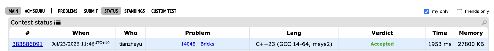

# Problem Set 7

## F. Bricks

https://codeforces.com/submissions/tianzheyu#

### Process
Modeled the grid tiling problem not by directly minimizing bricks, but by maximizing saved bricks through a min cut on a Flow Network. I assigned the S to represent horizontal merges and T to represent vertical merges. By creating dedicated nodes for black cells and edge nodes for valid adjacent pairs, I used infinite capacity edges to enforce that taking a merge profit (capacity 1 from S or to T) strictly required the corresponding grid cells to commit to that orientation, resolving conflicts via Min-Cut.

### Challenges and Overcoming

1. When defining the valid adjacent edges, I ran into a bug where my program calculated an inflated maximum flow because I was traversing in all four directions. This caused double counting effect where a single  adjacency between two cells was appeared as two separate edge nodes in the network. Next time to prevent this bug, I will restrict my grid traversal to only "right" and "down" to naturally eliminate duplicate relationships and halve the graph size.

2. Later, when constructing the network edges, I ran into a bug where the flow couldn't reach the target nodes properly. I found it when reviewing my capacity assignments and realized I had reversed the direction of the infinite capacity edges for the horizontal merges (making them cell to edge instead of edge to cell). Next time to prevent this bug, I will strictly diagram the flow path before writing the add_edge functions.