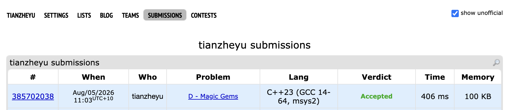

# Problem Set 8

## C. Magic Gems

### Process
To solve this, I modeled the problem as a dynamic programming sequence where dp[i] represents the number of valid configurations for i units of space. The state transition is dp[i] = dp[i-1] + dp[i-M]. Given that N can be up to $10^{18}$, a standard $O(N)$ iterative approach would have a result as Time Limit Exceeded. I optimized this by expressing the linear recurrence as a state transition matrix of size $M \times M$. By applying matrix exponentiation by squaring, I successfully reduced the time complexity to $O(M^3 \log N)$.

### Challenges and Overcoming

When coding my matrix multiplication function, I ran into a bug where I was getting incorrect answers for large inputs due to hidden integer overflows. I found it when I printed out the intermediate matrix values and noticed negative numbers; I realized that accumulating `a[i][k] * b[k][j]` multiple times before taking the modulo can exceed the limits of a `long long` integer. Next time to prevent this bug, I'll apply the modulo operation strictly at every single addition step inside the innermost loop, formatting it as `res[i][j] = (res[i][j] + a[i][k] * b[k][j] % MOD) % MOD` to ensure the accumulator never overflows.

I also ran into a minor bug where my base cases were failing because I initialized the identity matrix incorrectly for the fast exponentiation. I found it when testing $N < M$. Next time to prevent this, I will explicitly verify my base identity matrix initialization (setting strictly `res[i][i] = 1` and all other elements to `0`) by tracing the output of $A^0$ on a whiteboard before proceeding to the main logic.
