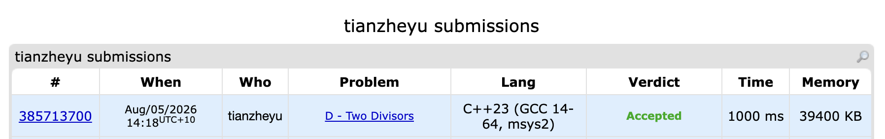

# Problem Set 8

## C. Magic Gems

### Process
I used the Sieve of Eratosthenes to precompute the Smallest Prime Factor for fast queries. For each number, I extracted the highest power of its smallest prime factor as $d_1$, and the remaining part as $d_2$. This guarantees that $d_1$ and $d_2$ share no common prime factors, satisfying $\gcd(d_1 + d_2, a_i) = 1$.

### Challenges and Overcoming
I thought my code was bugged because my terminal output for $24$ was `8 3`, while the official example showed `2 3`. I found this when directly comparing my results with the problem statement. I soon realized my answer was perfectly valid ($\gcd(8+3, 24) = 1$). The bug was simply me forgetting that this is a Special Judge problem where multiple outputs are correct. Next time to prevent this, I will carefully read the problem notes and manually verify the mathematical properties of my output rather than just string matching the example.

