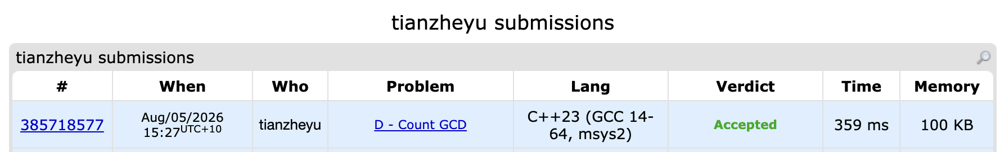

# Problem Set 8

## E. Count GCD

### Process
I used the prefix GCD property $\gcd(a_{i-1}, b_i) = a_i$ to simplify the problem into finding how many numbers $Y \le m / a_i$ are coprime to $X = a_{i-1} / a_i$. To count these efficiently, I extracted the prime factors of $X$ and applied the Inclusion-Exclusion Principle using bitmasking. I then multiplied the valid counts for each position modulo 998244353.

### Challenges and Overcoming
I ran into a bug where my program would output completely wrong answers or desynchronize on later test cases. I found it when I used a `break` statement immediately after detecting an impossible sequence ($a_{i-1} \pmod{a_i} \neq 0$). Because I was reading the array elements dynamically, breaking early left unread numbers in the `cin` stream, which were then incorrectly read as $n$ and $m$ for the next test case. Next time to prevent this bug, I will always read the entire input array into a `vector` first before applying any early-exit or `break` logic, ensuring the input stream remains perfectly synchronized.
