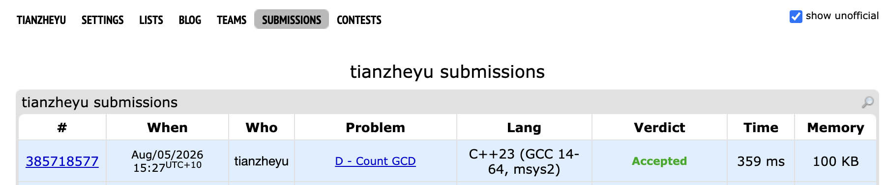

# Problem Set 8

## E. Another Filling the Grid

### Process
To solve this, I applied the Inclusion Exclusion Principle to the rows while treating the columns independently. By iterating through the number of "invalid" rows $i$ (where all numbers are $\ge 2$), I calculated the valid configurations for a single column and raised it to the power of $n$. To optimize the math operations, I encapsulated the modular exponentiation and factorial precomputations inside a self-contained, statically cached Lambda function for $O(1)$ `nCr` queries.

### Challenges and Overcoming
I ran into a bug where my program outputted a large negative number (e.g., `-229496814`) instead of the expected positive answer, failing on Test 3. I found it when reviewing the checker log. The issue was caused by how C++ handles the modulo operator `%` with negative numbers during the subtraction steps of the inclusion-exclusion formula; subtracting a larger modded value from a smaller one resulted in a negative remainder. Next time to prevent this bug, I will strictly use the safe modular subtraction format `(A - B % MOD + MOD) % MOD` whenever subtraction is involved to guarantee the result always wraps around to a positive integer.
