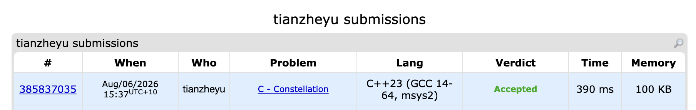

# Problem Set 9

## A. Constellation

### Process
Sorted the stars by their x and y coordinates, selected the first two points, and then iterated through the rest to find the first point that is not collinear with them.

### Challenges and Overcoming
When coding the condition to find the third point, I ran into a logic bug where I mistakenly used `==` instead of `!=` for the cross-product check, causing the code to look for collinear points instead of a valid triangle.

Additionally, when calculating the cross product, I ran into a bug where I used standard 32-bit `int` data types for the coordinates. I found it when my submission crashed on Test #93 with a `runtime error: signed integer overflow`. Since the coordinates can be up to 10^9, multiplying their differences exceeded the maximum limit of a 32-bit integer. Next time to prevent this bug, I will always double-check the variable constraints in the problem description before coding and default to using `long long` for any geometric calculations involving multiplication.
