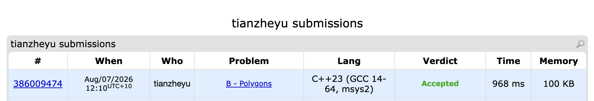

# Problem Set 9

## C. Polygons

### Process
Used binary search and integer cross products to verify if every vertex of polygon B is strictly inside the convex polygon A. Since the vertices were given in clockwise order, I adapted the cross-product sign checks to correctly map to the clockwise geometry, achieving $O(m \log n)$ time complexity without needing to reverse the input arrays.

### Challenges and Overcoming
When writing the binary search logic, I initially got stuck on how to properly set the boundary conditions for the cross product because the polygon vertices were given in a clockwise direction. If I had blindly applied the standard counter-clockwise formulas, the algorithm would have incorrectly evaluated the left and right boundaries, rejecting valid points. I realized this issue while manually tracing the vector directions for the clockwise layout to figure out the exact `< 0` and `>= 0` conditions. Next time to prevent this kind of logic bug in geometry problems, I will explicitly draw out the vectors on paper and map out the exact positive/negative cross-product conditions for the given orientation before writing the binary search loop.
