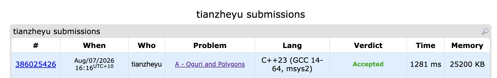

# Problem Set 9

## A. Oguri and Polygons

### Process
Precomputed the number of points strictly inside every possible triangle formed by the given vertices using bitsets. For each query, I triangulated the given convex polygon and summed the precomputed triangle values to get the total points inside.

### Challenges and Overcoming
When implementing the initial bitset solution, I ran into a performance bottleneck where I was computing the intersection of large bitsets for every single query. I found it when my submission hit a Time Limit Exceeded on Test 14, realizing that even highly optimized bitset operations were too slow for the 400,000 queries. Next time to prevent this performance issue, I will explicitly look for unusually small constraints in the problem description (like $N \le 40$) before coding and use them to shift the heavy computation entirely into an $O(N^3)$ precomputation phase, guaranteeing $O(K)$ minimal work per query.
