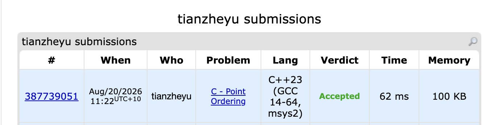

# Problem Set 9

## E. Point Ordering

### Process
I implemented the approach of finding the rightmost adjacent vertex, locating the vertex with the maximum triangle area, and partitioning the remaining points into two chains. These sets were then sorted locally to stay within the $\le 3n$ query limit.

### Challenges and Overcoming
When coding my partitioning logic, I ran into a bug where I accidentally included the peak vertex $Y$ in my loop and queried it against itself (e.g., sending a query for `1, Y, Y`). This caused the interactor to fail because the problem requires strictly distinct indices. I found this bug when I printed out all my outgoing queries to `stderr` and noticed the duplicate indices in the console output. Next time, to prevent this bug in interactive problems, I will add a strict `assert(i != j && i != k && j != k)` inside my custom query wrapper functions to catch illegal queries locally before sending them to the grader.
