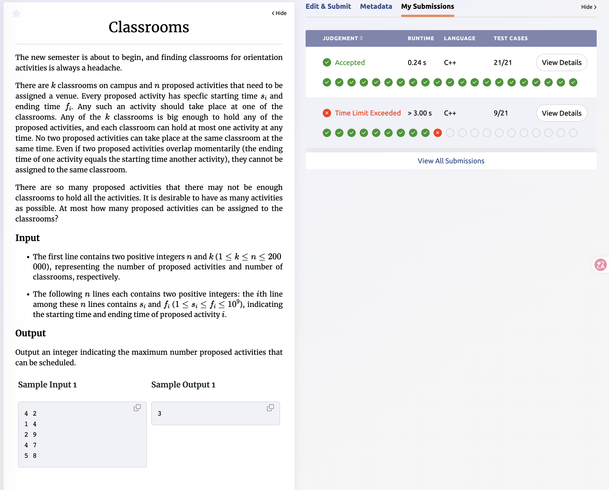
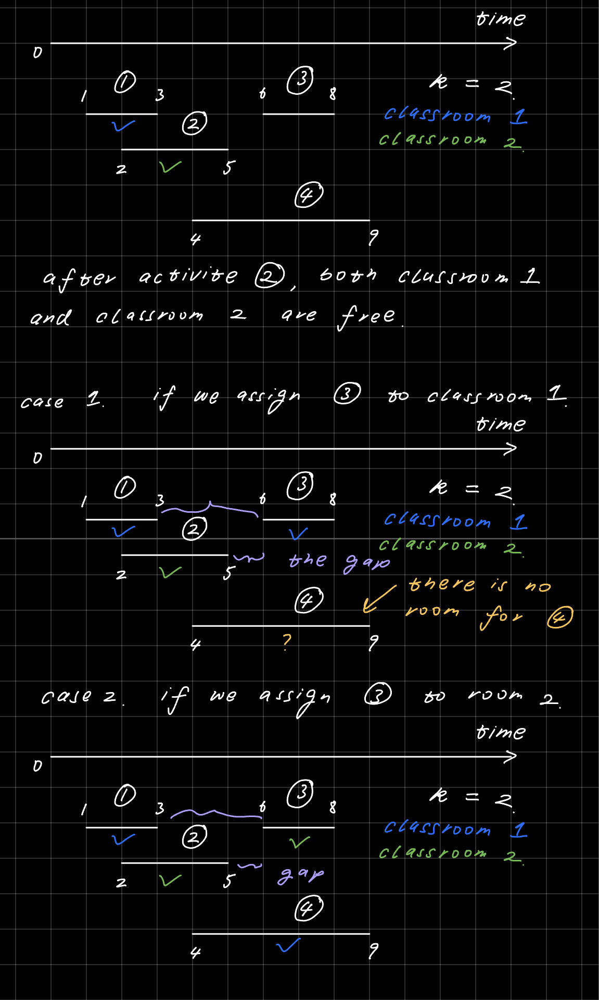

# Problem Set 2

## B. Classrooms



### Process
The question gives n activites(index i) with starting time s_i and finish time f_i and there are k classrooms. The task is to return the number of activites we can host using k classrooms without having 2 activites overlapping in the same classroom.

This is a greedy question. And greedy policy is consider those activites that end earliest and we put them into the valid classroom as late as we can.

1. Why Earliest End Time?

    If we only have one single room, this question becomes the stander question of Interval Scheduling. The greedy policy is to arrange the activites that end earliest first, i.e. sort activites according to the ending time. A simple logic to explain is that the more early the current activite ends, the more time the rest activites can get which will lead to an overall optimal solution.


2. Why Latest Valid Classroom?

    To be simple, the idea is we want to minimize the time gap between the end of previous activite and the start of the next activite for each classroom. This means for every vaild activite we have to assign it to the classroom that has previous activite ends latest.

    Here is an example:

    

    This example shows that by minimize the gap between the previous finishing time to the next starting time, we can allow more activites hosted by the same ammount of classrooms.

### Challenges and Overcoming
```cpp
int room_id = -1;
int latest_room_available_after = -2;
for (int j = 0; j < k; j++) {
    if (rooms_available_after[j] < start_time) {
        if (latest_room_available_after < rooms_available_after[j]) {
            room_id = j;
            latest_room_available_after = rooms_available_after[j];
        }
    }
}

if (room_id != -1) {
    rooms_available_after[room_id] = finish_time;
    result++;
}
```
I was using this loop to find the classroom that have previous activite ends latest, but this cause time limit exceeded. Instead of using this, a better appoarch is to use a multiset which stores the current finishing time of the last activite assigne to the room. We can use the lower_bound() method to find the first classroom that have finishing time larger than the starting time of current activite, and naturally the previous one is the room with the previous activite ends lastest.