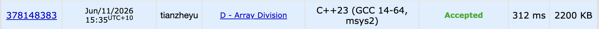

# Problem Set 2

## C. Array Division

### Process
The question provides an array, and the task is to tell if it can be devided to 2 arrays that such that the sum of the first array is equal to the second array. The constrain is that we can do one single move in the process. A move is erasing some element and inserting it into an arbitrary position.

### Challenges and Overcoming
The idea of this question is having 2 multiset to store the sum of prefix and suffix. And we will iterate thought every possible point to break the array to 2 arrays. In the process, 

1. if the current sum is equal to the half of total sum, since inserting an element in the same position he was erased from is also considered moving, this is already YES to the question, so we print out and return. 

2. if the current sum is less than half of the total sum, in this case we try to preform 1 move by checking if there is a number equal to half - current sum exsit in suffix so we can switch it to prefix and make suffix and prefix equal.

3. similarly, if the current sum is larger than half of the total sum, we try to preform 1 move by checking if there is a number equal to current sum - half exsit in prefix, so we can switch it to let prefix and suffix both equal to half of the total sum.