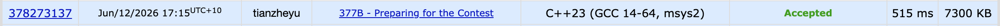

# Problem Set 2

## D. Preparing for the Contest



### Process
The question is saying that there are m bugs needed to be fixed. And each bug i has a complexity a_i. And we have n students to fix those bugs. Each student has a ability level, the student can only solve those bugs have a complexity less or equal to that student's ability level. And each student i wants to get c_i passes as reward for fixing bugs. s is the maximum total passes we can provide. The aim is to come up with the schedule of work saying which student should fix which bug in minimum days needed.


### Challenges and Overcoming

My initial thought is this is a greedy problem. And the greedy policy is trying to solve the bugs with as high complexity as possible. 

```cpp
sort(bugs.begin(), bugs.end(), [] (auto& a, auto& b) {
    return a.complexity > b.complexity;
});

long long total_given_passes = 0;
for (long long i = 0; i < m; i++) {
    long long level_required = bugs[i].complexity;

    if (level_required > highest_level) {
        cout << "NO\n";
        return 0;
    }

    auto iterator = students_available.lower_bound(Student{0, level_required, 0});

    if (iterator == students_available.end()) continue;

    Student student = *iterator;

    bugs[i].done_by = student.id;

    total_given_passes += student.reward;
    if (total_given_passes > s) {
        cout << "NO\n";
        return 0;
    }

    students_available.erase(students_available.find(student));
    students_not_available.insert(student);
}
```
And I will traverse all bugs in that order, and try to find the student with lowest ability level that satisfy the requirement to sovle the current bug. However, this idea doesn't work because of this counterexample:

- Student A: ability level = 3, reward = 100
- Student B: ability level = 10, reward = 10

If the current bug's complexity is 3, although student A is the student with lowest ability level that satisfy the requirement, student A cost too much, making student B more cost-effective. Since loop though all students strating from the student with lowest ability level that satisfy the requirement cost too much time in set, we need another data structure to get the most cost-effective student among all students that satisfy the requirement. Naturally, I picked priority queue according to their reward, since we can put every valid students in the queue, and pop the best one in the end.


There is another key idal was missing in the attempt 1. The problem explicitly asks us to minimize the number of days. In my initial attempt, once a student was assigned a bug, they were marked as unavailable. This implicitly assumes each student only works for 1 day and fixes exactly 1 bug. However, the question allows a single hired student to fix bugs up to d days, which means maximumly this student can fix up to d bugs (1 bug per day). This completely changes the cost-effectiveness.


After getting some hints, I know we can use binary search on the answer to optimize the day. 

Consider about having m days to solve all m bugs, if all the students can not solve all the bugs (m bugs in total), there must be some bugs with complexity higher than any student's ability level (otherwise, the student with ability level higher than bug complexity will surely fix m. bugs in m days). And clearly if we can fix all the bugs in d days, we can surely fix every bugs in d + 1 days. Thus, we can do binary search in the range from 1 to m.

To use binary search on the answer we need a check function.

```cpp
bool check_x_days(long long x, vector<Bug>& bugs, vector<Student>& students, long long s, long long n) {
    priority_queue<Student, vector<Student>, CompareReward> pq;

    long long student_index = 0;
    long long total_given_passes = 0;
    for (long long i = 0; i < bugs.size(); i += x) {
        long long hardest_complexity = bugs[i].complexity;

        while (student_index < n && students[student_index].level >= hardest_complexity) {
            pq.push(students[student_index]);
            student_index++;
        }

        if (pq.empty()) return false;

        Student best_student = pq.top();
        pq.pop();

        for (long long j = i; j < i + x && j < bugs.size(); j++) {
            bugs[j].done_by = best_student.id;
        }

        total_given_passes += best_student.reward;
        if (total_given_passes > s) return false;
    }

    return true;
}
```

For a fixed number of days (x days), each student we pick can fix up to x bugs. To maximize efficiency, we can bundle the bugs into groups of size x. Since our greedy policy is finishing harder bugs first, the first bug in the group is the hardest one in the group. If a student has the ability to do the first bug, then he can also finish all the bugs in that group.


For each group of bugs with size x, we push all students whose ability is larger than the hardest bug's comlexity into our min-priority queue (ordered by reward). And we pop the top of the queue(the most cost-dfficiency) and assign the entire group of question to him, and add his reward to our total cost. If we successfully assign all bundles without exceeding the total budget s, then x days is a valid answer. We shrink the upper bound to find an even smaller number of days.


