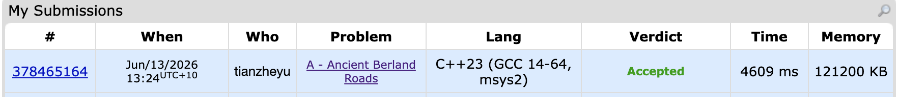

# Problem Set 2

## E. Ancient Berland Roads

### Process
The question provide n cities and m roads which link 2 cities together. Each city have a population. And there is q queries, in each query, we can block a road or update the population of a city. For each query, we need to output the population of the region with maximum population.

### Challenges and Overcoming
The brute force way is to build graph from the begining and update the graph in each query when we change block the road (remove the edge) or update the population, and run DFS to get all the connected components. However, in this solution the time complexity is O(q * (n + m)), which will require 10^11 computation. Therefore, it will have time limited exceeded.

To avoid duplication of computation, we need some data structure to maintain these connected components durning the queries. After getting some hints, I know we can use DSU to merge sets extremely quickly and maintain set properties (such as sum of populations in that component). 

However, as we mentioned, DSU is good at merging 2 components to 1 instead of breaking 1 to 2 (which is what we do in this question, we block 1 road from 1 city to another). A idea to solve that is we handle the queries from back to front. We first store all the queries and having the final graph. And we will traverse the queries from the last one to the first one. If it is a blocking road query, we will merge this 2 components togeter and update the population sum. If it is a population update query, we can just simplely change the population to that city. 

