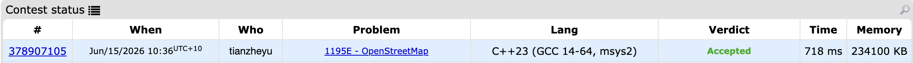

# Problem Set 2

## F. OpenStreetMap



### Process
The question gives a n x m matrix, and the aim is to find the sum of minimum values for each a x b matrix within that n x m matrix (a x b matrix is smaller in size than n x m matrix). 

### Challenges and Overcoming
The brute force solution is to travrse all possible a x b matrix and travrse all elements in that matrix to find the smallest value. However, this apporach has time limit exceeded

The way to sovle this problem is perform a row opration first, i.e. in a sliding window with length b, find the smallest value in each window. As a result, we will have `matrix_1` which is a n x (m - b + 1) matrix with the same ammount of rows but only record the minimum value for each window in row. Similarly, we will perform col oprations on `matrix_1` to get `matrix_2`, i.e. find the smallest value in each colum window with size a. Since all the elements in `matrix_1` are the smallest value in row window, and we've just found the smallest value in col window, the elements in `matrix_2` are smallest value in each a x b matrix. And to find the sum of that, we just simplly add each value in `matrix_2`.

Then the question becomes how to find minimum values in each window with size k.

```cpp
vector<long long> sliding_window_minimum(vector<long long>& numbers, int k) {
    deque<long long> dq;
    vector<long long> result;

    for (int i = 0; i < numbers.size(); i++) {
        if (!dq.empty() && dq.front() < i - k + 1) {
            dq.pop_front();
        }
        while (!dq.empty() && numbers[dq.back()] >= numbers[i]) {
            dq.pop_back();
        }
        dq.push_back(i);
        if (i >= k - 1) {
            result.push_back(numbers[dq.front()]);
        }
    }

    return result;
}
```

I have a deque which is a monotonically increasing (for the value of the index) queue storing index. Storing indices allows us to determine if an element has expired. As the window slides to the right, we need to know exactly whether the element at the front of the queue has fallen outside the window's range. Storing the value alone doesn't reveal its physical position, but storing the index allows us to easily verify the expiration boundary using the current index i and the window size k. We will have followring steps: 

1. Remove indices that are physically outside the current window.
2. Kick out elements that are larger than the current element. They are useless because they are both larger and older. This keeps the queue strictly increasing.
3. Add the current index.
4. Once the first window of size k forms, the front of the queue is always the window's minimum.