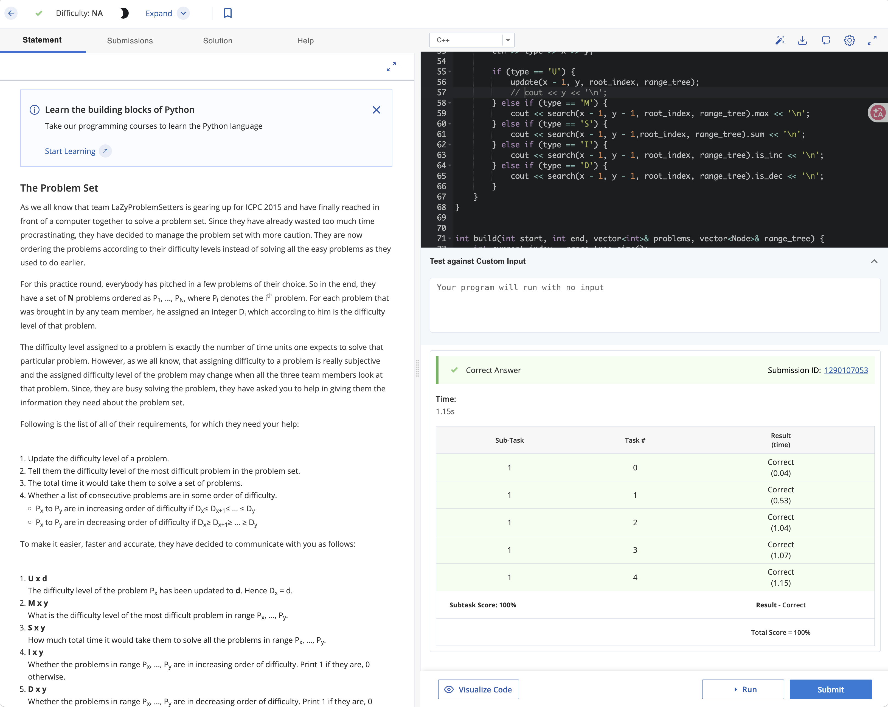

# Problem Set 3

## A. The Problem Set

### Process
The question provides n problems with D_i difficulty level. There are 4 operations:

1. Update the difficulty level of a problem.
2. Tell the difficulty level of the most difficult problem in range P_x to P_y.
3. Tell the total time it would take them to solve all the problems in range P_x to P_y.
4. Tell whether the problems in range Px, ..., Py are in increasing order of difficulty.
5. Tell whether the problems in range Px, ..., Py are in decreasing order of difficulty.

### Challenges and Overcoming
Clearly, since this is a range problem and max, sum, increasing and decreasing are binary associative operators, we can use range tree in this case.

Then, I need 3 methods to handle the range tree.

1. `int build(int start, int end, vector<int>& problems, vector<Node>& range_tree)`: this function takes all the problems in a vector, and the range we want to build the range tree. Initially, the range should be that whole problem set. This method can recursively build the range tree by having left subtree and right subtree built first and combine this 2 nodes to build the current node.

2. `void update(int x, int new_value, int root_index, vector<Node>& range_tree)`: this function can update the tree due to the update of the difficulty of a certain question. It will recursively update the tree by updating the leaf node first and update the side effect among the path from that leaf node to the root node.

3. `QueryResult search(int start, int end, int root_index, vector<Node>& range_tree)`: given the range, this method search for the QueryResult in that range.

The sum opration and max opration are stander ways of using range tree. Checking if the difficuties are sorted require extra information in `Node`. I have `bool is_inc`, `bool is_dec`, `int first_val`, `int last_val` in the `struct Node`. Everytime when I need to check if the current range is asc/desc, I will break the range into 2 part, and if these 2 subrange are both asc and last_val of first range is less or equal to the first_val of the second range, then the whole range is asc. This is similar to desc case.