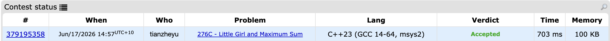

# Problem Set 3

## B. Little Girl and Maximum Sum

### Process
The queation provides an array, and we are allowed to reorder it before actually preform queries. One query includes a range in array, and the result is adding all element in that array. The task is to maximum the total sum of the results of each query.

### Challenges and Overcoming
Since we have n query and each query has a range, this means to maximum the total sum, we just simplly need to put high value element in to the possition that appear more often in those range in the queries. To do that, we need to caculate the frequency for each posstions in the array. However, if we looping though each query and update freqency, it takes O(q * n). Instead, we can maintain a `diff` vector to record the difference starting from current index. For example, if there is a range (a, b), we will make `diff[a]++` and `diff[b]--`. After all queries, we will looping though the diff array, and make `prev[i] = prev[i - 1] + diff[i]`.

After doing this, we sort the original array given in the problem from largest to smallest, and also sort the calculated frequency in descending order. Multiply the largest number by the highest frequency, the second largest number by the second highest frequency, and so on, this greedy policy make sure that result is maximum.