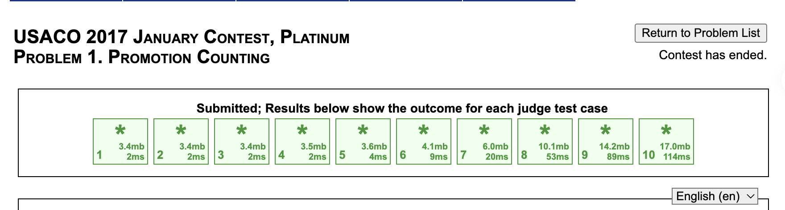

# Problem Set 3

## D. Promotion Counting

### Process
The question is saying that there are n cows (have id 1 to n), each has a distinct proficiency rating. They want to establish a company such that the cow with id 1 is the president (don't have a manager), and any other cow has some manager that mange him/her. The problem is to find the number of cows from the ones that the current cow is that has a higher proficiency rating than the current cow. 

### Challenges and Overcoming

The broute force way of solving this question is for each cow, we seach for every cow that managed by it. The time complexity is O(n^2).

After getting some hints, I know we can use range tree in this question, but here comes 2 major problems:

1. In the graph of organizational structure, it is a tree but one node can have muiltiple children nodes, but in a range tree, one node can only have 2 children nodes. This means we need somehow construct a range tree according to the graph of organizational structure.

2. In the range tree, we need to declear the range and operation to merge 2 nodes to get the value of parent node. The question is how to decide what is the range and the merging operation.

To deal with this, we intorduce the DFS order, i.e. using dfs each node will either be on the path we are currently exploring or not. And each node will be added to currently exploring path onec and be removed onec. We can have a timer in dfs to record each node's range(when did the node be added and when did the node be removed). And we can use this to build the range tree. 

To find the number of cows that managed by the current cow, we just need to find how many cows in that range, since if a cow was explored in between the range of current cow, it must be subordinate of current cow. But the question wants the number of cows who has a larger ranking than current cow, we just simplly sort cows according to their ranking, and add it to the range tree in that order. This makes the range tree only record the number of cows that have larger ranking than the current one.