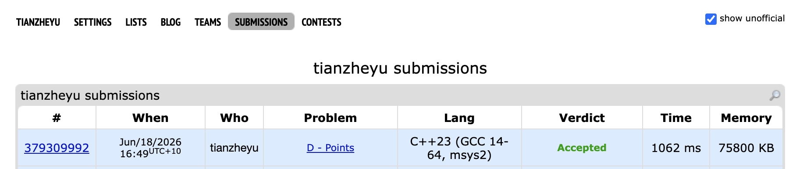

# Problem Set 3

## G. Jewel heis

### Process
The question is saying that there are n jewels on the 2D plane. These jewels have k colors. Define one grab as taking all the jewels lying on some horizontal segment or below it. The task is to find the maximum number of jewels one grab can get without getting all k colors.

### Challenges and Overcoming

**Reverse Thinking**

Cannot contain all colors means at least one color is completely excluded. Suppose the currently excluded color is C, then all jewels that have color C become obstacles that must not be included in the region.

**Monotonic Stack for Maximal Rectangles**

For each excluded color C, the problem is transformed into finding the maximum empty rectangle regions that does not contain a color C jewel. Using the X distance between two adjacent mines as the width and the Y coordinate of the mine as the height constraint, a monotonic stack can be used to find the set of "maximum candidate rectangles" for all colors in a time complexity of O(N). 

**Data Decoupling**

To meet the needs of different algorithms, the Jewel data must be stored in two copies. One copy, grouped by color (`vector<vector<Jewel>>`), is used for efficient rectangle finding using a monotonic stack; the other copy, globally flattened (`vector<Jewel>`), is used for subsequent scanline sorting.

**Sweep Line & Segment Tree**

All jewels and all found candidate rectangles are uniformly sorted by their Y-coordinate (height) from smallest to largest. A horizontal scanline is used to scan from bottom to top: when a jewel with a height $\le$ of the rectangle's height is encountered, its discretized X-coordinate is added to the segment tree (single-point update +1); when processing the current rectangle, the sum of its left and right boundaries (left, right) is directly queried in the segment tree, which is the total number of jewels that can be captured by that rectangle.