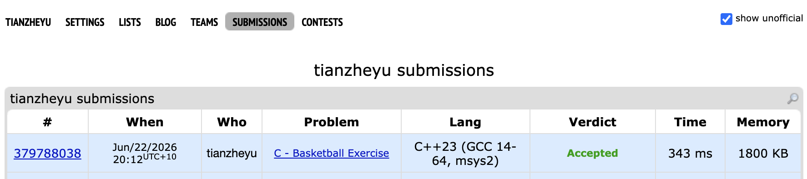

# Problem Set 4

## A. Basketball Exercise



https://codeforces.com/submissions/tianzheyu#

### Process
There are 2 rows of students each with a height. We are trying to pick some students from these 2 rows with maxiumum sum of heights. The constrain is we can not choose consecutive students belong to the same row. And we will choose players from left to right, and the index of each chosen player (excluding the first one taken) will be strictly greater than the index of the previously chosen player. 

The question is saying to find the maximum sum of height, the initial thought is using greedy or dp. However, consider the second test case:
```
1 2 9
10 1 1
```
In the second colum, it is picking the local maximum 2 can not lead to a global maximum. This means the greedy doesn't work and we have to think about dp.

Since we are going to choose palyer that have a larger index than the one we previously chose, there will be no choice but to pick the higher student from the last colum if we decide to start at last colum to pick. This can be a base case for our dp. 

And since we are not alowed to choose consecutive students belong to the same row, for the second last colum, the result is the value in right colum next to the current one but in the other row. These 4 cell are the base cases for this dp question.

### Challenges and Overcoming

Since we are not alowed to choose consecutive students belong to the same row, the transition function can be `dp[0][i] = max(dp[1][i + 1], dp[1][i + 2]) + row1[i - 1].height;`.


**Why don't we need to think about `dp[1][i + 3]`**

Because the problem states that all student heights are positive integers (h >= 1), any jump of 3 or more steps is mathematically guaranteed to be a suboptimal choice. It can always be replaced by a combination of smaller jumps that yields a strictly greater total sum.