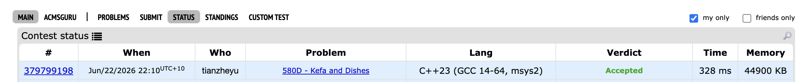
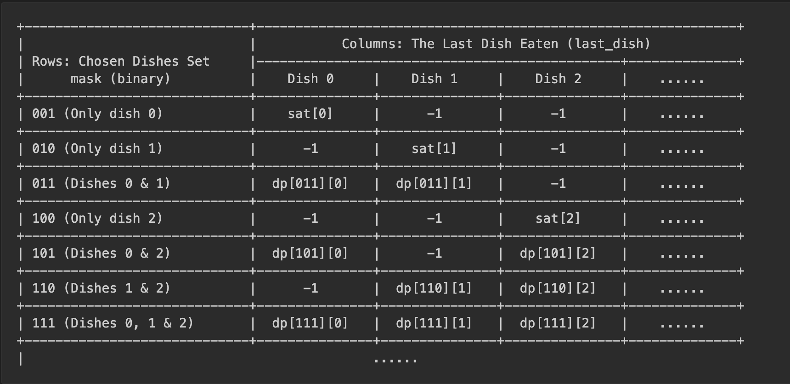

# Problem Set 4

## A. Basketball Exercise

https://codeforces.com/submissions/tianzheyu#

### Process
There are n dishes each with a satisfaction level. And there are k rules each has 3 values x, y, z such that if the person takes dish x and immediatly takes dish y, he can get extra z satisfaction. The task is to find the maximum overall satisfaction he can get after taking m dishes.

### Challenges and Overcoming
Since 1 ≤ m ≤ n ≤ 18, this is a hint from using bitmask dp. Bitmask can be used as a set to keep track of which dishes we have already taken. And since we can get extra satisfaction if we take 2 dishes continuously as in the rules, we also need to keep track of the previous dish we've already taken. Therefore, our dp table looks like this:

**Base Cases**
The base cases should be if we only take 1 dish, there is no previously taken dish, so the satisfaction natually be the satisfaction of that dish only.

**Transform Function**
For each cell (mask, i), we will first check if i is in the bitset, otherwise it makes no sence that we have perviously taken the dish i if i is not even in the set of dishes have been taken. Then, we will get the satisfaction from the previous stage (i.e. with no i in the set (`mask & ^(1 << i)`)), we will loop though that row and get the maximum satisfaction in that stage. And in this process, we will check if there is a rule `rule[q][i]` (satisfaction we get if first take dish q and then take dish i). We will get the maximum and fill that into the cell.

**Finial Answer**
To get the finial answer, we just loop though the table, and for each bitset with m elements, we keep track of the largest satisfaction we get. And that is the finial answer.