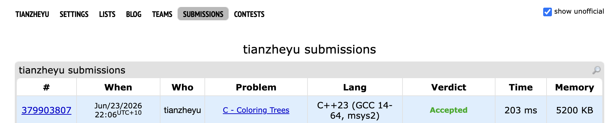

# Problem Set 4

https://codeforces.com/submissions/tianzheyu#

## D. Wi-Fi

### Process

There are n rooms. For each room i, there are 2 ways to connect to internet:

1. connect to the Internet directly, and this cost i,
2. connect to the Internet via routers, a router in room j can cover rooms from `min(j - k, 1)` to `max(j + k, n)`. And not every rooms have a spot for a router.

### Challenges and Overcoming

Initially, I intuitively thought of using a 2D Interval DP (`dp[i][j]`). However, with the number of rooms `n` up to 200,000, an O(N^2) approach would immediately cause a Memory Limit Exceeded (requiring around 320GB of memory) and a Time Limit Exceeded. 

*Overcoming:* I reduced the state to a 1D DP, where `dp[i]` represents the minimum cost to cover all of the first `i` rooms. 

In a standard 1D DP, we usually only look at historical states. But here, room `i` can be covered by a router placed in room `i + k` (which is in the "future").

*Overcoming:* I shifted my perspective. When processing room `i`, instead of just looking back, I actively search for a valid router `j` within the range `[max(1, i - k), min(n, i + k)]` that can cover room `i`.

When implementing the nested loop to find router `j`, I encountered two major bugs:
*   **Out of bounds (RE):** I didn't properly clamp the boundaries for checking the string `spots[j - 1]`, leading to negative indices.
*   **Wrong historical cost (WA):** I mistakenly added the cost of router `j` to `dp[i - k - 1]`. Actually, since router `j` covers everything from `j - k` to `j + k`, the latest room that still needs coverage is `j - k - 1`.

    *Overcoming:* I strictly clamped the boundaries using `max()` and `min()`, and corrected the transition equation to `dp[max(0, j - k - 1)] + j`. I also introduced `dp[0] = 0` as a clean base case.

Even after fixing the bugs, the nested loop `for (int j = ...)` resulted in an O(N * K) time complexity, which was still too slow for the 2-second time limit. 
*Overcoming:* I utilized a crucial mathematical property: the `dp` array is monotonically non-decreasing. Because the costs only increase, the leftmost available router `j` that can cover room `i` (meaning `j >= i - k`) will always yield the cheapest historical cost `dp[j - k - 1] + j`. By precomputing an array (e.g., `next_router`) to instantly locate the nearest router to the right, I successfully eliminated the inner loop, bringing the final time complexity down to a perfect O(N)!