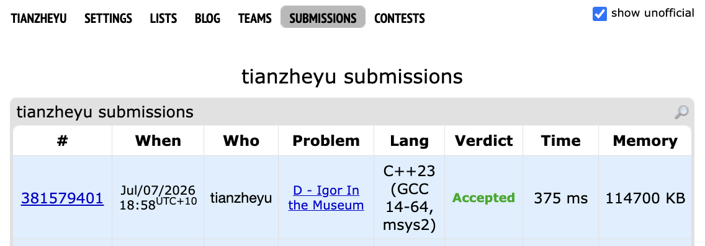

# Problem Set 5

## B. Igor In the Museum

https://codeforces.com/submissions/tianzheyu#

### Process
The question provides a rectangular field of n * m cells. Empty cells are marked with '.', impassable cells are marked with '*'. Every two adjacent cells of different types (one empty and one impassable) are divided by a wall containing one picture.

There are k queries, each is asking how many picture the person can see if his starting possition is (x, y).

### Challenges and Overcoming
The question is asking how many pucture the person can reach in one connected component, since he can not reach the cell separeted by impassable cells. Instead of doing dfs each time, we can pre calculate number of picture the person can see for each connected components and map each cell to that component. Thus, we can return the number of picture in O(1) during the query.